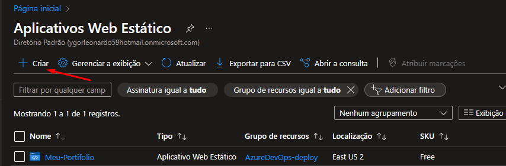

# Deploy de um site estático na Azure Integrado com o Az-DevOps.

Esse tutorial tem como objetivo criar uma esteira de deploy automatizado usando:

- GitHub
- Azure Pipelines
- Azure Static Web
  
##

- **Criado um Static Web App no Portal da Azure.**
    
    **1** - Acesse o Azure Portal e procure o serviço **Static Web App** e clique em criar.
    
    
    
    **2** - Ao criar o serviço se atente as seguintes informações:
    
    - Selecione o Grupo e Recurso.
    - Escolha um nome pro seu Static Web App.
    - Marque a opção gratuito.
    - Marque a origem como outros (pois vamos criar um deploy automatizado).
    
    
    
    **3** - Acesse o seu Static Web App na Azure e nele você vai conseguir ver:
    
    - O nome do seu serviço.
    - O Gerenciar o token de implantação ( vamos precisar! ).
    - Url do nosso serviço.
    
    
    
    **4** - Clique em Gerenciar o token de implantação e Copie o token gerado e salve em um bloco de notas.
    
    
    
##

- **Criado uma pipeline yaml integrada com o GitHub.**
    
    **1** - Criamos uma pipeline Yaml no nosso Azure DevOps utilizando o nosso GitHub.
    
    
    
    **2** - Selecionamos o repositório aonde vai ser criado nossa Pipeline yaml. E criamos uma do zero.
    
    
    
    
    
    **3** - Adicione a task  “**Deploy Azure Static Web App”**  e em app_Location coloque o caminho dos  arquivos (html/Css/JS) que está no seu repositório.
    
    - Após isso iremos criar uma variável **$(token)** aonde vamos colocar o token que foi criado no nosso **Static Web App no Azure.**
    - Também iremos adicionar um trigger na main, para que, a pipeline sempre rode quando tiver um commit na Main.
    
    
    
    **4** - Agora crie uma nova Variables no seu pipeline Yaml com o nome de “**token**” e cole o token que você copiou para o bloco de notas e clique em ok → Save.
    Nota: Recomendo marcar a opção “**Keep this value secret**”.
    
    
    
    **5** - Após seguir os passos acima, rode a pipeline e quando a mesma concluir, acesse a url do seu Static Web App.
    
    
    
    
    
    **6** - Pronto, seu site estático está hospedado e integrado com o Azure DevOps e automatizado.
    
    - Quando tiver um commit na main do seu repos, a pipeline ira disparar e com isso fara um upload do seu site estático no seu Static Web App na Azure, fazendo com que, seu site sempre esteja atualizado com suas mudanças.
    - Vejo o meu site: [**https://lemon-mud-0b9108f0f.4.azurestaticapps.net**](https://lemon-mud-0b9108f0f.4.azurestaticapps.net/)
